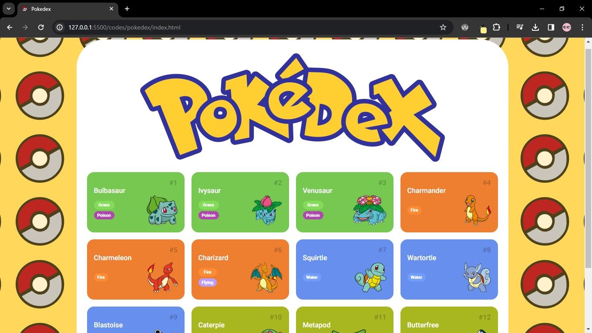
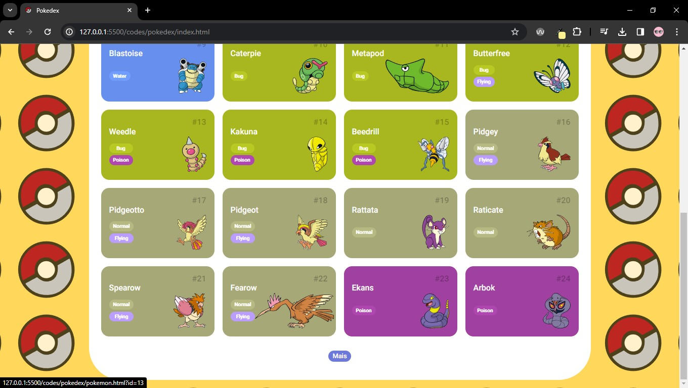
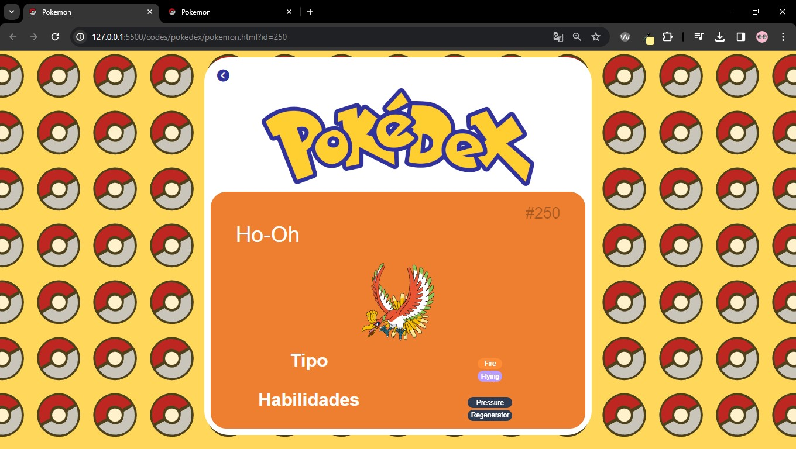
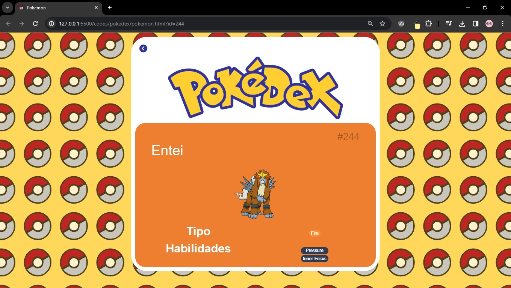

# Projeto pokedex

Este projeto foi desenvolvido no segundo módulo onde foi realizado o consumo da Api [pokeApi](https://pokeapi.co/), neste projeto a primeira página tem um retorno dos 12 primeiros pokemons, e possui um botão que carrega mais 12 pokemons. 

